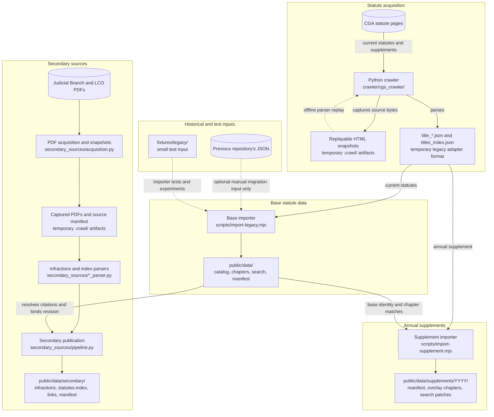
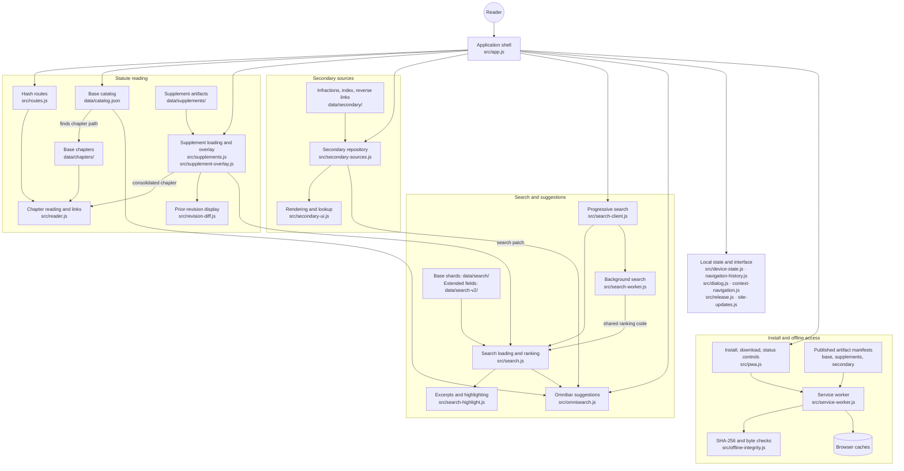
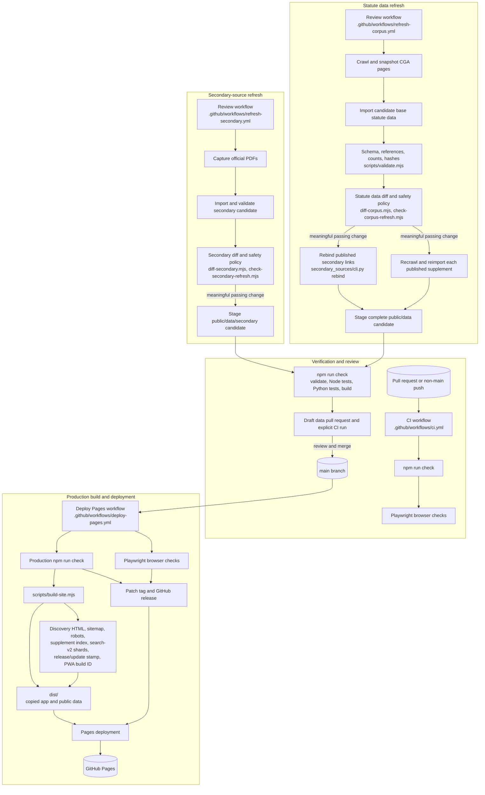

# Repository map

This map covers the repository's production data paths, browser behavior, build outputs, automation, and supporting code. Arrows mean "produces," "loads," or "controls" as labeled; they do not imply that a build-time tool runs in the browser. The many chapter, search, and index shards are represented by their directories rather than by individual files.

## 1. Source acquisition and published data

The old repository is not an input to scheduled refreshes or the website. The current crawler still emits its **JSON shape** as a temporary adapter, which the base and supplement importers consume. The published [base statute data](../public/data/) is checked in; the [2026 supplement](../public/data/supplements/2026/) and [secondary sources](../public/data/secondary/) are separate published artifacts. Source snapshots and candidate directories under `.crawl/` are staging and review evidence, not browser data.

## 2. Browser and offline paths

The browser loads only the artifacts it needs for a route or search. The latest published supplement overlays base chapters and search results in memory; it does not rewrite the base files. Bookmarks, preferences, and history remain in browser storage. The service worker manages the application shell, visited data, and an explicitly downloaded full set of published data. The separate [commit feed](../public/commit-feed/) is a standalone page that reads the GitHub commits API; it is not the app's embedded, build-time recent-updates list. The app also requests the latest completed refresh-run status from the GitHub Actions API and offers an optional feedback form that submits to FormSubmit; neither service supplies statute content.

## 3. Validation, refresh, build, and deployment

The refresh workflows retain source captures and reports as temporary Actions artifacts. They propose data changes through draft pull requests; deployment happens after a change reaches `main`. The [base validator](../scripts/validate.mjs) also validates published supplements and secondary sources. [JSON Schemas](../schemas/) define artifact shapes, while validators add cross-file and integrity checks. `npm run check` builds the site, and the deployment workflow separately runs browser checks before publication. Existing workflow, command, and file names containing `corpus` still refer to the base statute data.

## 4. Directory and module index

| Area | Ownership and important files |
| --- | --- |
| [crawler/](../crawler/) | CGA acquisition: `config.py`, `fetch.py`, `snapshots.py`, `parsing.py`, `pipeline.py`, and `cli.py`; Python tests and HTML fixtures in `crawler/tests/`. |
| [secondary_sources/](../secondary_sources/) | PDF acquisition, infractions and subject-index parsing, canonical publication, offline rebinding, CLI, and Python tests. |
| [scripts/](../scripts/) | CLIs for importing, validation, diffing, policy review, site building, and local serving. `scripts/lib/` holds their importer, validator, diff, policy, discovery, supplement, search-v2, release, and PWA implementations. |
| [public/data/](../public/data/) | Checked-in base statute artifacts plus supplement editions and secondary-source datasets. Runtime reads these after the build copies them to `dist/data/`. |
| [src/](../src/) | Interactive application, route and reader logic, search and secondary clients, local state, PWA/service worker, HTML, CSS, fonts, and icons. |
| [public/commit-feed/](../public/commit-feed/) | Standalone Confluence-friendly commit feed, copied into `dist/` by the build. |
| [schemas/](../schemas/) | JSON Schemas for base, supplement, secondary, search, and build artifacts. |
| [config/](../config/) | Versioned statute data and secondary-source refresh policies, plus overrides for embedded site-update text. |
| [.github/workflows/](../.github/workflows/) | Pull-request CI, Pages deployment/release, statute data refresh, and secondary-source refresh. |
| [test/](../test/) | Node unit/integration tests and Playwright browser, accessibility, PWA, and visual checks in `test/browser/`. |
| [fixtures/legacy/](../fixtures/legacy/) | Small adapter-format dataset for tests; it is not the production source. |
| [docs/](./) and [reports/](../reports/) | Runbooks, architecture notes, and reviewed validation records. |
| `dist/`, `.crawl/`, `node_modules/`, `playwright-report/`, `test-results/` | Generated build, staging, dependencies, and test outputs; not source-of-truth content. |

### Key contracts

- **Authoritative legal-text unit:** a base chapter file in `public/data/chapters/`. Catalog and search data are navigation and search derivatives.
- **Supplement boundary:** an edition under `public/data/supplements/YYYY/`, bound to a specific version of the base statute data and applied without mutating that base.
- **Secondary boundary:** records under `public/data/secondary/`, with publisher provenance and citation links bound to the base statute data.
- **Offline boundary:** browser caches are replaceable delivery copies. Published JSON and its manifests remain authoritative.
- **Deployment boundary:** `dist/` is assembled from checked-in `src/` and `public/` plus build-derived files, then served by GitHub Pages.

For detail on the contracts and review procedures, see [Architecture](../ARCHITECTURE.md), [statute data refresh](corpus-refresh.md), [supplements](supplements.md), and [secondary sources](secondary-sources.md).
